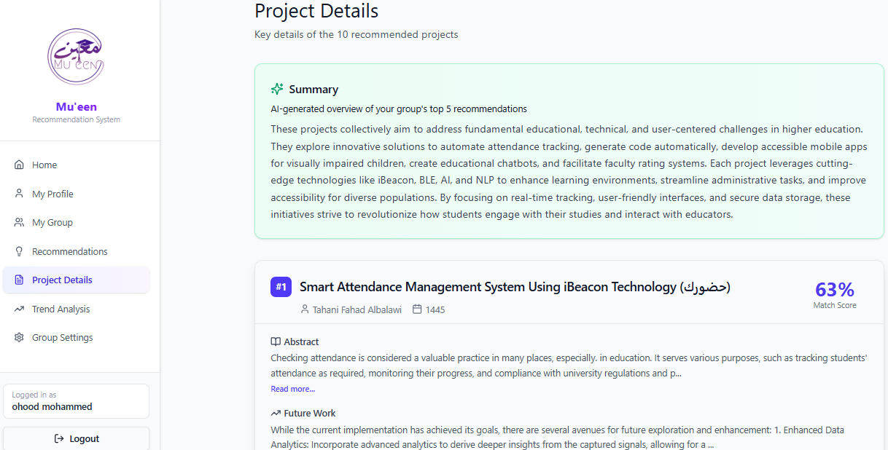
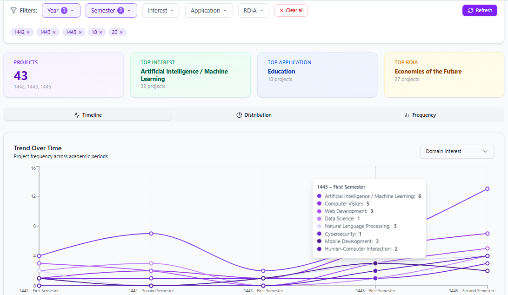
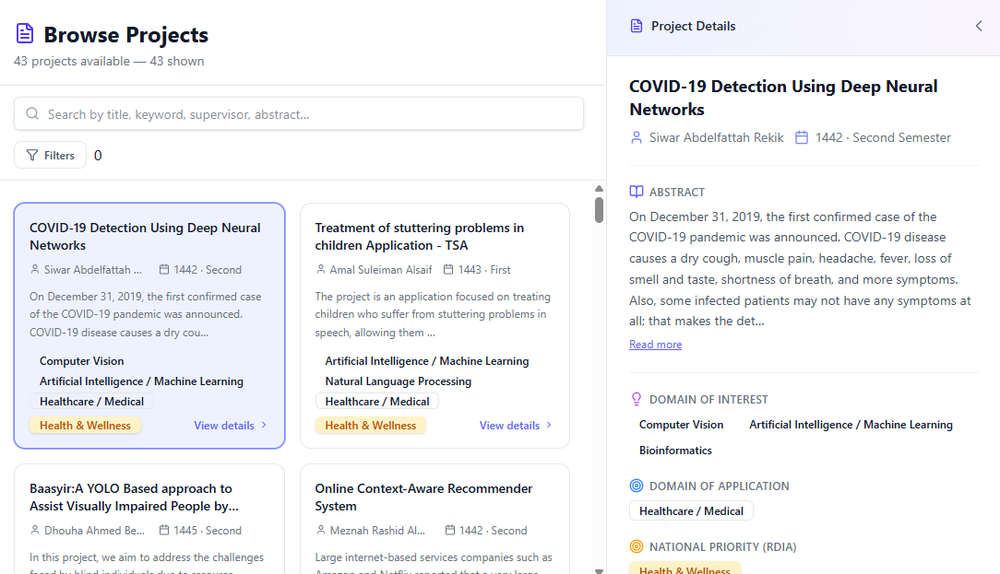

# Mu'een — Project Recommendation System
<p align="center">
  
</p>

Mu'een is an intelligent graduation project recommendation system for CCIS at Imam Mohammad Ibn Saud Islamic University.

It recommends suitable graduation projects for student groups based on:
- Academic performance (courses & grades)
- Research interests
- Application domains
- RDIA priorities

The system uses semantic embeddings and AI-powered summarization to deliver explainable and personalized recommendations.


## ※ Mu'een Features

❊ Intelligent project recommendation using semantic similarity  
❊ Group-based recommendation system  
❊ Trend analysis of graduation projects  
❊ AI-generated project summaries  
❊ Advanced filtering and project browsing  
❊ Adjustable recommendation weighting system  

## ※ How Mu'een Works

1. Students complete their academic profile
2. System aggregates group preferences
3. Semantic embeddings are used to match projects
4. Recommendation engine ranks projects
5. AI generates explanations and summaries

## ※ Core Recommendation Engine
 
The recommendation logic powering Mu'een is documented in detail in a dedicated repository:  
[GP-Recommender](https://github.com/Shahad0100/GP-Recommender.git)
 
This covers the full technical breakdown of the embedding strategy, hybrid retrieval pipeline, group profile construction, and domain scoring logic.

## ※ System Screenshots

### Similar Projects 
<p align="center">
  
</p>

### Trend Analysis
<p align="center">
  
</p>

### Browse Projects
<p align="center">
  
</p>

   
## Project Structure

```
project-recommender/
├── backend/              # Flask API server
│   ├── app.py            # Main application entry point
│   ├── database.py       # SQLite database layer
│   ├── embedding_engine.py
│   ├── models.py
│   ├── phase2_embed.py   # One-time embedding generation script
│   ├── requirements.txt
│   ├── summarizer.py
│   ├── trend/            # Trend analysis module
│   └── utils.py
├── data/                 # Domain taxonomy and project JSON files
├── embeddings/           # Pre-computed project and course embeddings
├── frontend/             # React + TypeScript frontend (Vite)
│   └── src/
│       ├── components/   # Page and UI components
│       ├── contexts/     # Auth context
│       └── services/     # Axios API client
├── recommenders/         # Recommendation logic modules
├── recommender_system.py # Main recommender orchestrator
└── RS_Evaluation/        # Evaluation scripts and results
```

## Prerequisites

- Python 3.10+
- Node.js 18+

## Setup and Run

### Backend

```bash
cd backend
pip install -r requirements.txt
python app.py
```

The API server starts at `http://localhost:5000`.

### Frontend

In a separate terminal:

```bash
cd frontend
npm install
npm run dev
```

The app opens at `http://localhost:3000`.

### Using a virtual environment (recommended)

```bash
python -m venv venv
# Windows
venv\Scripts\activate
# macOS / Linux
source venv/bin/activate

cd backend
pip install -r requirements.txt
python app.py
```

## Notes

- Embeddings are pre-computed and included in the `embeddings/` directory. If you add new projects, run `python backend/phase2_embed.py` to regenerate them.
- The database (`backend/recommendation.db`) is created automatically on first run.
- An OpenAI API key is required for the project summary feature. Set it as the `OPENAI_API_KEY` environment variable before starting the backend.


## Team

<p align="center">

**Mu'een Project Team**

| Name | ID |
|------|----|
| Abeer Hasan Othman | 443019197 |
| Dhekra Adel Dabwan | 443520332 |
| Ohood Mohammed Al-Magedi | 443520331 |
| Shahad Abdullah Baelaian | 443019212 |

</p>

---

## Supervisor

<p align="center">
Dr. Waad Alhoshan, PhD
</p>
